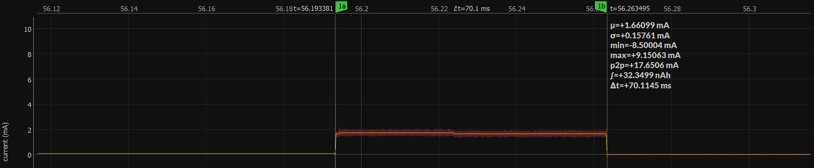

# iCE40 Power Testing

The goal of this exercise is to understand from a power point of view, what the various tradeoff's in the iCE40 FPGA are. This would allow us to design battery powered devices that use the FPGA and estimate battery life and also provide design time guidance.

# Setup
- The hardware used is the [iCE40 breakout board](https://www.latticesemi.com/en/Products/DevelopmentBoardsAndKits/iCE40UltraPlusBreakoutBoard) from Lattice. This board was chosen as it breaks out all power rails of the FPGA. 
- I used the PCF file from the [UPduino](https://github.com/tinyvision-ai-inc/UPduino-v3.0) as its identical. 
- The absolutely wonderful [icestorm](http://www.clifford.at/icestorm/) toolchain was used as its very fast and scriptable. I would expect comparable results from the vendors Radiant toolchain.
- Current on each rail was measured using a [Joulescope JS110](https://www.joulescope.com/products/joulescope-precision-dc-energy-analyzer).
- A toy math example is provided where two 8 bit counters are multiplied together to get a 16 bit result on every clock cycle.

# Results
_Note:_ All currents in the table are in uA.

| Description | PLL (1.219V) | Bank 0 (3.283V) | Bank 1 (3.283V) | Bank 2 (3.283V)| Core (1.219V)|
| ---         | ---   | ---    | ---    | ---    | ---  |
| Unconfigured | 4.4 | 1.29   | 1552 | 1.5 | 381.6 |
| Reset        | 4.4 | 1.29 | 82.9 | 1.5 | 188.3|
| Blank design | 4.1 | 1.3  | 3.4  | 1.5 | 85.6 |
| External 12 MHz + 28 bit counter (32 LC's) | 4.1 | 1.3  | 3.4  | 1.5 | 613.5 |
| External 12 MHz + 28*2 bit counter (60 LC's) | 4.1 | 1.3  | 3.4  | 1.5 | 616.65 |
| External 12 MHz + 28*4 bit counter (116 LC's) | 4.1 | 1.3  | 3.4  | 1.5 | 624.2 |
| External 12 MHz + 28*8 bit counter (228 LC's) | 4.1 | 1.3  | 3.4  | 1.5 | 641.3 |
| HFOSC (48 MHz) + 24 bit counter (28 LC's) | 4.1 | 3.76 | 3.4 | 1.5 | 2184 |
| HFOSC (24 MHz) + 24 bit counter (28 LC's) | 4.1 | 3.76 | 3.4 | 1.5 | 1162 |
| HFOSC (12 MHz) + 24 bit counter (28 LC's) | 4.1 | 3.76 | 3.4 | 1.5 | 645 |
| HFOSC (6 MHz) + 24 bit counter (28 LC's) | 4.1 | 3.76 | 3.4 | 1.5 | 388.4 |
| LFOSC (10 kHz) + 24 bit counter (28 LC's) | 4.4 | 3.76 | 3.4 | 1.5 | 96.3 |
| External halted clock (0 kHz) + 24 bit counter (28 LC's) | 4.4 | 3.76 | 3.4 | 1.5 | 92.1 |
| HFOSC (12 MHz) + Math (no DSP) + 24 bit counter (208 LC's) | 4.1 | 3.76 | 3.4 | 1.5 | 996 |
| HFOSC (12 MHz) + Math (1 DSP) + 24 bit counter (72 LC's) | 4.1 | 3.76 | 3.4 | 1.5 | 882 |
| HFOSC + RGB (48 MHz clock) | 4.4 | 321.9 | 3.4 | 1.5 | 2195 |
| PLL (12MHz in, 16MHz output) | 138.6 | 1.29 | 3.42 | 1.4 | 1419 |
| PLL (12MHz in, 32MHz output) | 138.9 | 1.29 | 3.42 | 1.4 | 2029 |
| PLL (12MHz in, 48MHz output) | 103.6 | 1.29 | 3.42 | 1.4 | 2573 |

# Observations
- Done LED connection take 150uA! Disconnect this for lowest power.
- The RGB driver takes ~280uA, setting the CURREN or the RGBLEDEN to zero drops this current entirely.
- Holding the FPGA in reset or leaving it unconfigured consumes more power than if its programmed with an actual low power design.
- Enabling pullup resistors on inputs did not change the power consumption at all. This is likely due to the IO not picking up much interference. Touching the IO in this state causes power to go up.
- Mapping math to a DSP slice makes sense from the power point of view, in the above toy example, we save about 110uA.
- A minimally functional FPGA (10kHz, 24 bit counter) can consume as little as 4.4*1.219 + 3.76*3.3 + 3.4*3.3 + 1.5*3.3 + 96.3*1.219 = 151uW. The power consumption with such a low clock rate does not change significantly with increasing design size (a 1536 wide counter causes the core current to increase by 3uA). This implies that the FPGA will work quite well if used in a system where the clock can be dropped to 10kHz for long periods of time. The 10kHz clock allows the FPGA to respond to an interrupt and also switch to a faster clock. Alternatively, the clock can be completely halted on this FPGA as well if supplied by an external clock as shown by the halted clock test.

## Bootup
The FPGA boots from Flash programmed with low power 10kHz design. The FPGA configures itself from flash and draws power on the core and SPI flash bank (Bank 1) as shown below. The total energy consumption numbers as well as boot times are important for applications that will power off the FPGA and require it to boot up infrequently for power saving. As shown in the plots below, booting from the flash consumes about 46nAh of energy and takes about 70ms from start to finish. Note that this does not include the flash chip power consumption!

# A sample low power design
OK, great, now that we have measurements, what good is it if we cant use it! 
Lets start with a toy design so its easy to understand.
## Requirements
- Slow clock is to be the low speed 10kHz that allows the FPGA to respond to external interrupts 
- Wake up for 50ms to do some useful work every few seconds, the "worker design" may be clock gated or kept running at 10kHz in case it needs to respond to an interrupt.
- Work when awake should be at 48MHz clock

## Design
Clearly, we need to gate the clock on the FPGA when its asleep. Switching the design between 10kHz and 48MHz requires special care to avoid glitches on the clock when multiplexing between the two clocks. A Glitch free clock mux is a pretty standard component that does this cleanly.

The 10kHz oscillator feeds not only the GFCM but also the timekeeper which switches the clock to the design that does the work. The timekeeper is a simple counter that selects the higher clock rate for 50ms every 3.2s. 

The design that does the work in this case is a simple LED blinker and could be replaced by something quite complex.

A simple testbench was used to prove out the design and get rid of bugs...

## Results
The full design consumes 62 LC's, 3 SB_GB, 1 LF_OSC, 1 HF_OSC and the RGB driver.
Heres the current consumption of the FPGA on the core power rail. As you can see, this seems to have achieved the goal!

- Only power on the core rail is measured
- The 135uA current baseline is much higher than the current in the table measured. Its not clear what this is due to.
- Duty cycling works! Peak current is 2mA while baseline power is about 135uA, average is 162uA as measured by the current meter.
- The high frequency oscillator had to be disabled to get to the 135uA baseline when its output was not selected. If this isnt done, the baseline is significantly higher at about 630uA when the selected clock is 10kHz.

# Future work
- Check out power when mapping to BRAM vs. registers
- Power consumption of IO banks with voltage and driving known loads
- Current variation vs. temperature
- Any other ideas?